# 🤖 AI-Powered Student Support System

An AI-powered web application developed to provide students with faster, more organized, and accessible academic and technical support.

The system includes separate **Student, Staff, and Admin portals**, an AI-based student assistant, support ticket management, FAQs, notices, a knowledge base, user management, and system analytics.

---

## 📌 Project Overview

The **AI-Powered Student Support System** is designed to help students quickly find answers to common university-related questions and communicate with support staff when additional assistance is required.

The AI Assistant searches information stored in the system's trusted Knowledge Base and provides relevant responses.

When OpenAI API integration is configured, the system can use the retrieved Knowledge Base information to generate more natural responses.

If reliable information is unavailable, the system avoids providing unsupported university information and recommends checking FAQs or creating a support ticket.

---

## ✨ Main Features

### 👨‍🎓 Student Portal

- Student registration and login
- Student dashboard
- AI Student Assistant
- AI question history
- View FAQs
- View university notices
- Create support tickets
- Select ticket category and priority
- View ticket status
- Reply to staff messages
- View recent tickets
- Manage profile
- Update password

### 👨‍💼 Staff Portal

- Staff login
- Staff dashboard
- View student support tickets
- View ticket details
- Assign tickets
- Reply to students
- Update ticket status
- Manage ticket workflow
- Mark tickets as:
  - Pending
  - In Progress
  - Resolved
  - Closed

### 🛠️ Admin Portal

- Admin dashboard
- Manage students
- Create and manage staff accounts
- Activate/deactivate users
- Manage support categories
- Manage FAQs
- Manage notices
- Manage Knowledge Base articles
- View AI activity
- View unanswered AI questions
- View ticket statistics
- Reports and analytics
- User management
- Category management
- AI Knowledge Base management

---

## 🤖 AI Student Assistant

The system includes an AI-powered assistant designed specifically for **student support**.

### AI Workflow

```text
Student Question
       ↓
Question Processing
       ↓
Keyword Extraction
       ↓
Synonym Expansion
       ↓
Knowledge Base Search
       ↓
Relevance Scoring
       ↓
Relevant Information Found?
       ↓
       ├── Yes
       │     ↓
       │ Trusted Knowledge Context
       │     ↓
       │ AI Response Generation
       │     ↓
       │ Answer Displayed to Student
       │     ↓
       │ Question Saved to AI History
       │
       └── No
             ↓
       No Unsupported Answer
             ↓
       Suggest FAQ or Support Ticket
```

---

## 🧠 AI Features

- Knowledge Base retrieval
- Keyword matching
- Synonym-based matching
- Relevance scoring
- Confidence scoring
- Grounded AI responses
- OpenAI API integration
- AI question history
- Unanswered question tracking
- Knowledge source identification
- AI usage analytics
- Support-ticket fallback

The assistant is designed primarily for university and student-support questions rather than unrestricted general-purpose question answering.

---

## 🎫 Support Ticket System

Students can create support requests by selecting a category and providing:

- Subject
- Description
- Priority
- Support category

Staff members can then:

1. View the support ticket
2. Assign the ticket
3. Reply to the student
4. Update the ticket status
5. Resolve or close the ticket

Students and staff can communicate through a **two-way ticket conversation system**.

---

## 🔐 Role-Based Access Control

The system contains three main user roles:

| Role | Main Access |
|---|---|
| **Student** | AI Assistant, AI History, FAQs, Notices, Tickets, Profile |
| **Staff** | Dashboard, Support Tickets, Ticket Assignment, Ticket Replies |
| **Admin** | Full system management, Knowledge Base, Users, Reports and Analytics |

Laravel middleware is used to prevent users from accessing unauthorized areas of the system.

---

# 🛠️ Technologies Used

## Backend

- Laravel 12
- PHP
- Laravel Eloquent ORM
- Laravel Middleware
- Laravel Authentication

## Frontend

- Blade Templates
- Tailwind CSS
- JavaScript
- Vite
- Responsive Web Design

## Database

- MySQL
- phpMyAdmin

## Artificial Intelligence

- OpenAI API
- Knowledge Base Retrieval
- Keyword Matching
- Synonym Matching
- Relevance Scoring
- Confidence Scoring
- Grounded AI Responses

## Development Tools

- Visual Studio Code
- XAMPP
- Composer
- Node.js
- npm
- Git
- GitHub

---

## 🗄️ Main Database Tables

The system uses database tables including:

```text
users
categories
tickets
ticket_replies
faqs
notices
knowledge_articles
ai_questions
```

---

# 📊 Reports & Analytics

The Admin Portal provides system analytics including:

- Number of registered students
- Number of staff members
- Total support tickets
- Pending tickets
- In-progress tickets
- Resolved tickets
- Closed tickets
- Total AI questions
- AI answers found
- Unanswered AI questions
- AI success rate
- Popular support categories
- Recent support tickets
- Recent AI activity

---

# 📷 Project Screenshots

## 🔐 Login Page

Users can log in to the system or create a new student account.

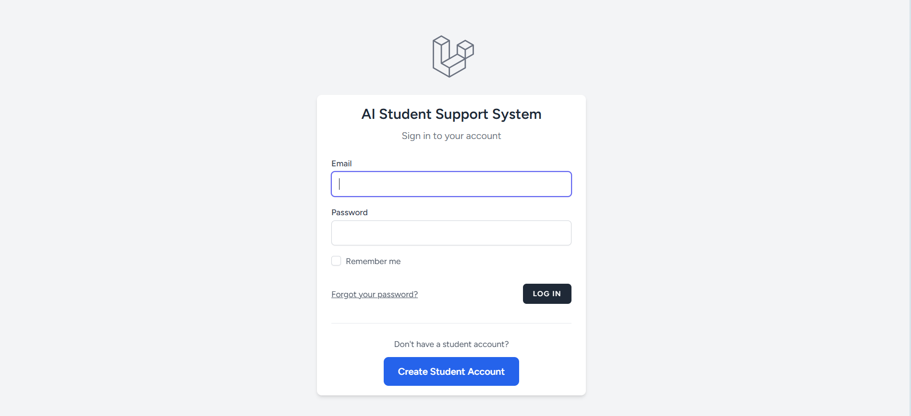

---

## 👨‍🎓 Student Dashboard

The Student Dashboard displays ticket statistics, AI usage, recent tickets, and quick-access features.

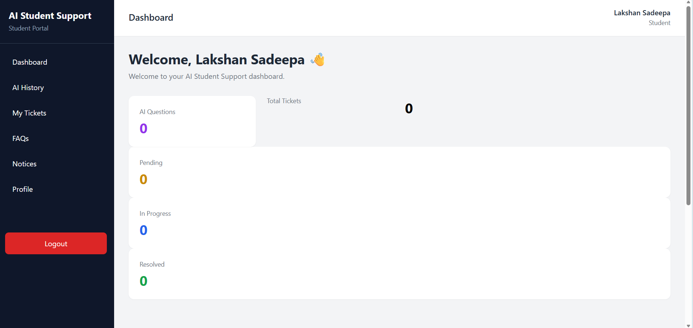

---

## 🤖 AI Student Assistant

Students can ask university-related questions through the AI Student Assistant.

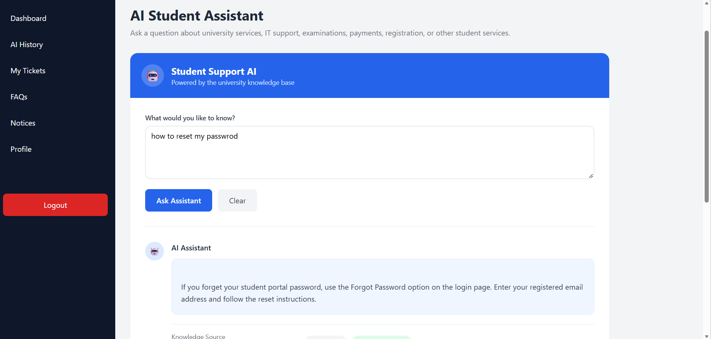

---

## 🎫 Create Support Ticket

Students can create support requests by selecting a category, priority, subject, and description.

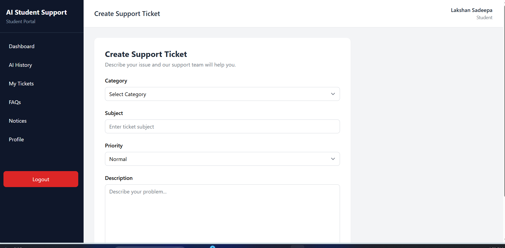

---

## 🛠️ Admin Dashboard

The Admin Dashboard provides an overview of students, staff, support tickets, AI activity, Knowledge Base articles, FAQs, and notices.

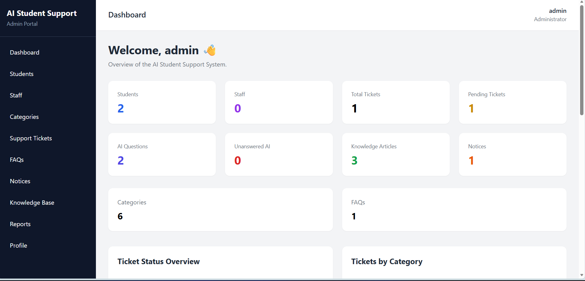

### Dashboard Analytics

The dashboard also contains visual analytics for ticket status and support categories.

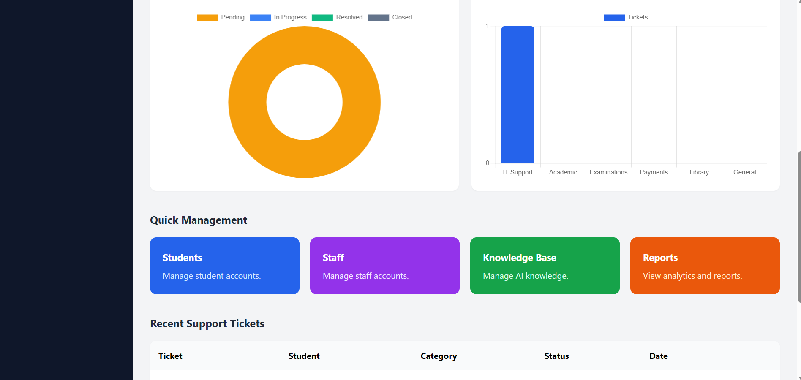

---

## 👥 Student Management

Administrators can view, edit, activate, deactivate, and delete student accounts.

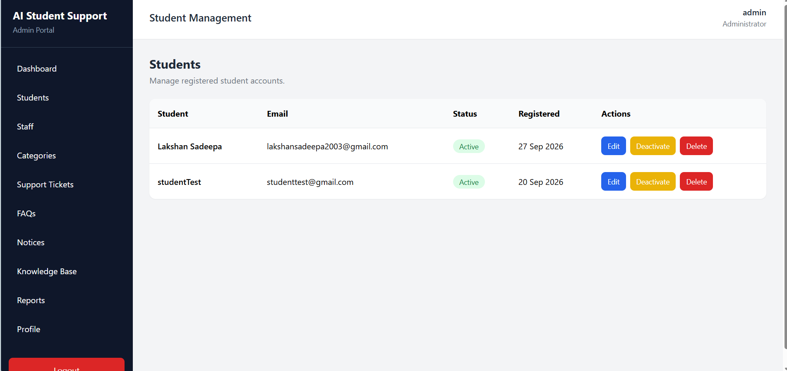

---

## 👨‍💼 Staff Management

Administrators can create and manage staff accounts.

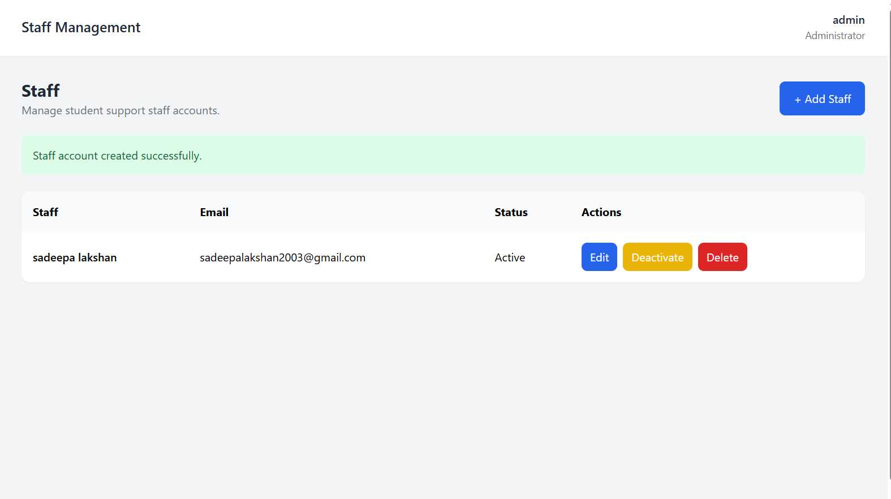

---

## 🗂️ Category Management

Administrators can manage support categories used by the ticketing system.

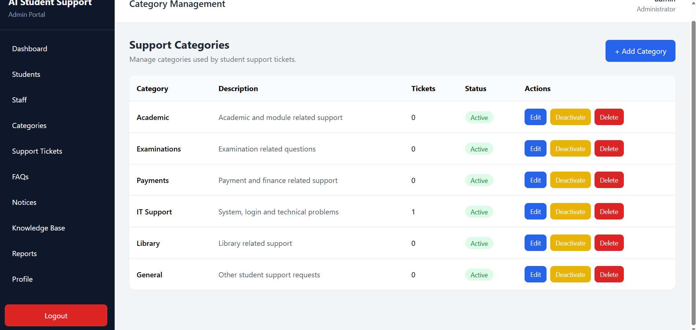

---

## ❓ FAQ Management

Administrators can create, edit, activate, deactivate, and delete FAQs.

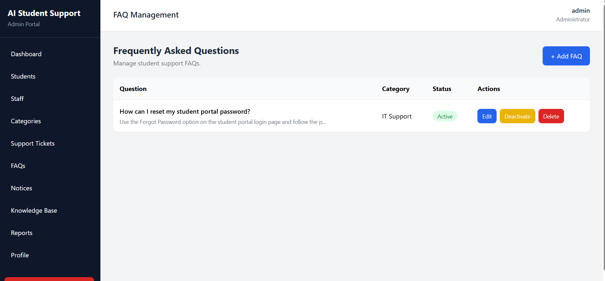

---

## 📢 Notice Management

Administrators can create and manage notices displayed to students.


---

## 📚 Knowledge Base Management

The Knowledge Base contains trusted information used by the AI Student Assistant.

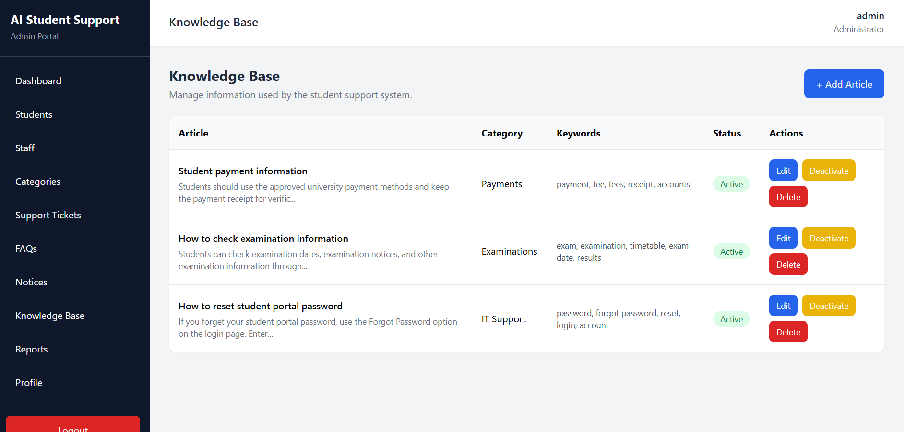

---

## 📊 System Reports & Analytics

Administrators can view ticket statistics, user statistics, AI Assistant performance, and support activity.

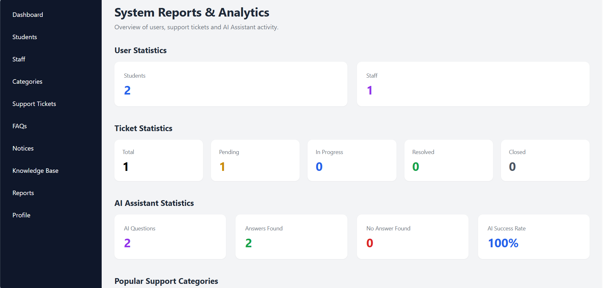

---

# 🚀 Installation and Setup

## 1. Clone the Repository

```bash
git clone https://github.com/Magehewalagesadeepalakshan123/ai-student-support.git
```

Move into the project folder:

```bash
cd ai-student-support
```

---

## 2. Install PHP Dependencies

```bash
composer install
```

---

## 3. Install Node Dependencies

```bash
npm install
```

---

## 4. Create Environment File

Copy:

```text
.env.example
```

and create:

```text
.env
```

Configure the database:

```env
DB_CONNECTION=mysql
DB_HOST=127.0.0.1
DB_PORT=3306
DB_DATABASE=ai_student_support
DB_USERNAME=root
DB_PASSWORD=
```

---

## 5. Generate Laravel Application Key

Run:

```bash
php artisan key:generate
```

---

## 6. Create MySQL Database

Open **phpMyAdmin** and create a database named:

```text
ai_student_support
```

Then run:

```bash
php artisan migrate
```

If you have an exported project database `.sql` file, you can alternatively import it using phpMyAdmin.

---

## 7. Configure OpenAI API

Add your own API configuration to `.env`:

```env
OPENAI_API_KEY=your_api_key_here
OPENAI_MODEL=your_supported_model
```

> ⚠️ Never upload your real OpenAI API key to GitHub.

The `.env` file must remain ignored by Git.

---

## 8. Clear Laravel Cache

```bash
php artisan optimize:clear
```

---

## 9. Start Laravel Server

```bash
php artisan serve
```

Laravel will normally run at:

```text
http://127.0.0.1:8000
```

---

## 10. Start Vite

Open another terminal and run:

```bash
npm run dev
```

---

## 11. Open the Application

Open:

```text
http://127.0.0.1:8000
```

---

# ▶️ Running the Project Later

After closing the project or restarting the computer:

1. Open **XAMPP**
2. Start **MySQL**
3. Open the project folder in Visual Studio Code
4. Open Terminal 1 and run:

```bash
php artisan serve
```

5. Open Terminal 2 and run:

```bash
npm run dev
```

6. Open:

```text
http://127.0.0.1:8000
```

---

# 📁 Project Structure

```text
ai-student-support/
│
├── app/
│   ├── Http/
│   │   ├── Controllers/
│   │   └── Middleware/
│   │
│   ├── Models/
│   ├── Services/
│   └── Providers/
│
├── bootstrap/
│
├── config/
│
├── database/
│   └── migrations/
│
├── public/
│
├── resources/
│   ├── css/
│   ├── js/
│   └── views/
│       ├── admin/
│       ├── auth/
│       ├── staff/
│       └── student/
│
├── routes/
│   ├── auth.php
│   └── web.php
│
├── screenshots/
│   ├── login.png
│   ├── student-dashboard.png
│   ├── ai-assistant.png
│   ├── create-ticket.png
│   ├── admin-dashboard-1.png
│   ├── admin-dashboard-2.png
│   ├── student-management.png
│   ├── staff-management.png
│   ├── categories.png
│   ├── faq.png
│   ├── notices.png
│   ├── knowledge-base.png
│   └── reports.png
│
├── tests/
│
├── .env.example
├── .gitignore
├── artisan
├── composer.json
├── package.json
└── README.md
```

---

# 🔒 Security Features

The project includes several security features:

- Laravel authentication
- Secure password hashing
- CSRF protection
- Role-based middleware
- Server-side form validation
- Protected Admin routes
- Protected Staff routes
- Student ticket ownership validation
- Environment-based API key configuration
- Session-based authentication
- Unauthorized access protection
- Sensitive `.env` configuration excluded from GitHub

---

# 🎯 Project Purpose

The main purpose of the **AI-Powered Student Support System** is to improve student support by combining traditional support-ticket management with AI-assisted question answering.

The system provides students with faster access to information while allowing staff and administrators to efficiently manage more complex support requests.

It also provides administrators with information about commonly asked questions, unanswered AI queries, support categories, ticket activity, and overall system performance.

---

# 💡 How the System Works

```text
Student
   ↓
Register / Login
   ↓
Student Dashboard
   │
   ├── AI Assistant
   │      ↓
   │   Knowledge Base
   │      ↓
   │   AI Response
   │
   ├── FAQs
   │
   ├── Notices
   │
   └── Support Ticket
            ↓
          Staff
            ↓
      Assign / Reply
            ↓
      Update Ticket Status
            ↓
          Student


Admin
   ↓
Manage Students
Manage Staff
Manage Categories
Manage FAQs
Manage Notices
Manage Knowledge Base
Monitor AI Questions
View Reports & Analytics
```

---

# 📚 Learning Outcomes

This project helped improve skills in:

- Laravel development
- PHP programming
- MySQL database design
- MVC architecture
- CRUD operations
- Laravel authentication
- Role-based authorization
- Middleware
- Database relationships
- AI API integration
- Knowledge Base retrieval
- AI response grounding
- Tailwind CSS
- Responsive UI development
- JavaScript
- Git version control
- GitHub project management
- Full-stack web application development

---

# 🌐 GitHub Repository

Project Repository:

https://github.com/Magehewalagesadeepalakshan123/ai-student-support

---

# 👨‍💻 Developer

**Lakshan Sadeepa**

BSc Information Technology Undergraduate

Developed as an academic and portfolio project using Laravel, PHP, MySQL, and AI technologies.

---

# ⚠️ Important Security Notice

Never commit or publicly share:

```text
.env
OpenAI API keys
Database passwords
Secret credentials
Access tokens
```

Use `.env.example` to provide configuration examples without exposing private information.

---

# 📄 Project Status

✅ Authentication  
✅ Student Portal  
✅ Staff Portal  
✅ Admin Portal  
✅ AI Student Assistant  
✅ Support Ticket System  
✅ FAQ Management  
✅ Notice Management  
✅ Knowledge Base  
✅ Role-Based Access Control  
✅ Reports & Analytics  
✅ AI Question History  
✅ Dashboard Statistics  

---

# 📄 License

This project was developed for educational, academic, and portfolio purposes.